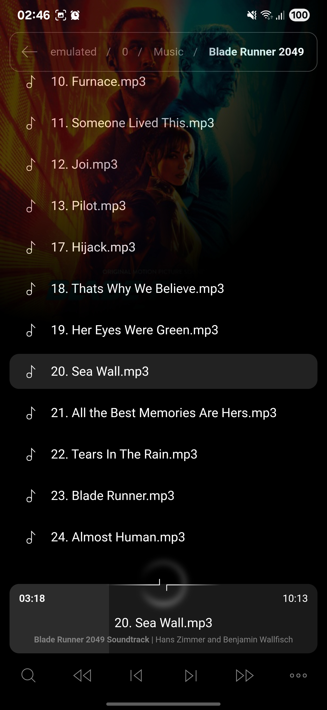
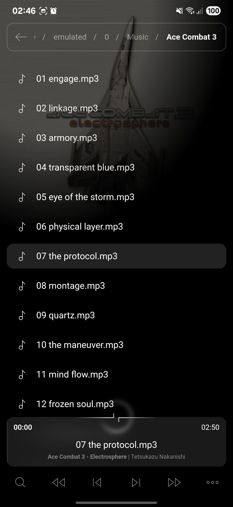
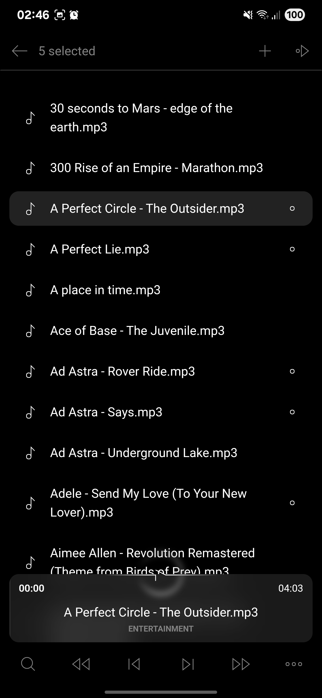
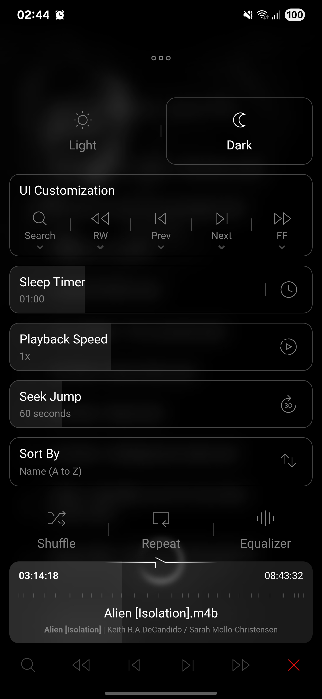
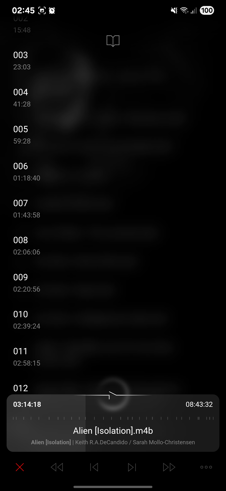
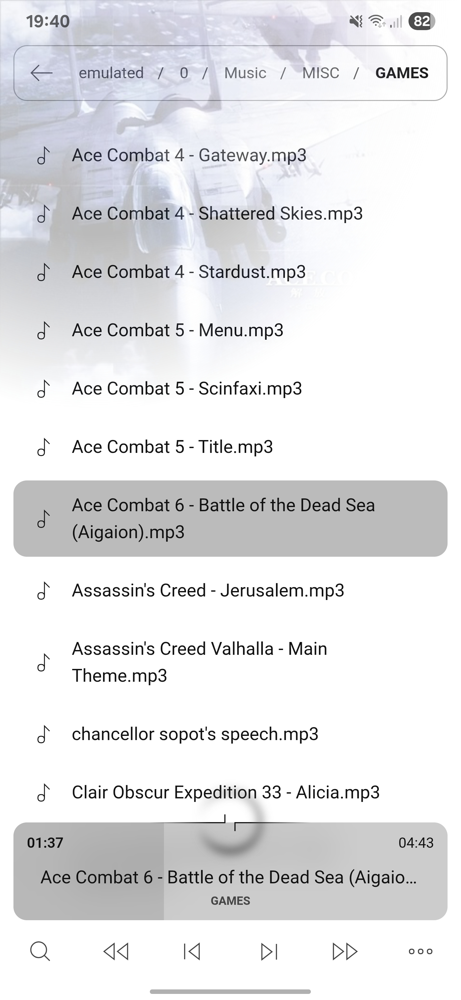

# Minimalist Music

A light weight, folder-based clean music player built with a combination of Kotlin for the Android native backend and Vanilla JavaScript/HTML/CSS for the frontend. It integrates native Android features with a web-based UI rendered in a WebView.

## Features
- Supports `mp3`, `wav`, `m4b`, `m4a`, `flac`, `midi`, `ogg`, `opus`, `aac` files
- Built-in folder explorer
- Dynamic queues (long-press a track item)
- Audiobook chapters
- Metadata lyrics unsynced (`UNSYNCEDLYRICS` tag) + synced (local lrc files)
- Maintains playback position, speed, shuffle, and repeat states, etc.
- Lock screen + Bluetooth controls
- Light + Dark themes
- Change playback speed
- Sleep timer
- Search
- Customizable UI

## Special Thanks
- @wseemann for the awesome `ffmpegmediametadataretriever` library. The only metadata library that could retrieve embedded chapter metadata.
- [Angular Icons](https://angularicons.com/) for the awesome icons.

## Screenshots
|Now Playing|Now Playing|Select Mode|
|:-:|:-:|:-:|
||||

|Settings|Chapters|Light Theme|
|:-:|:-:|:-:|
||||
