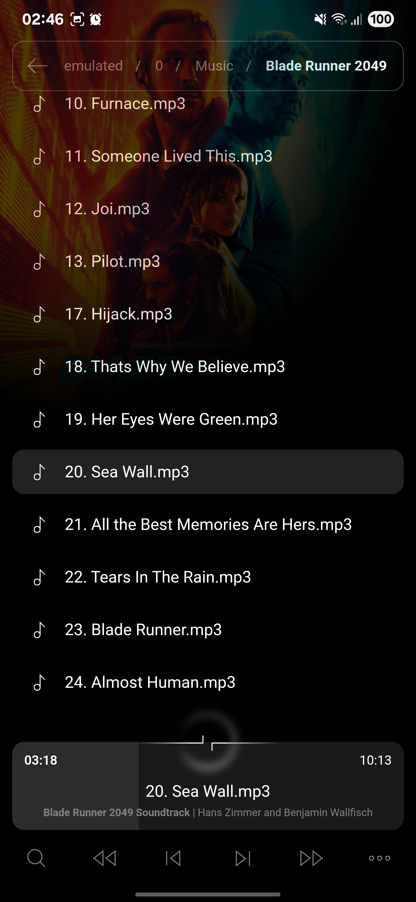
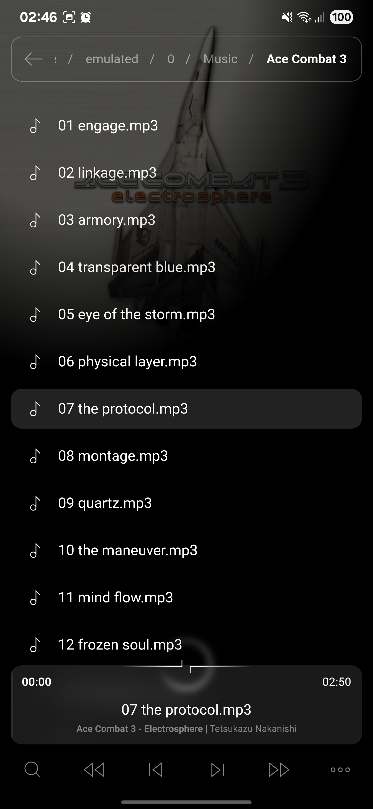
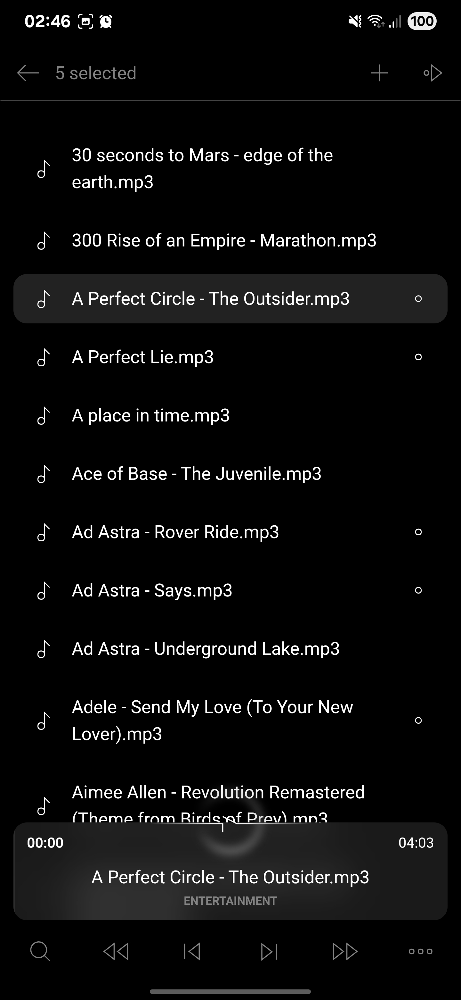
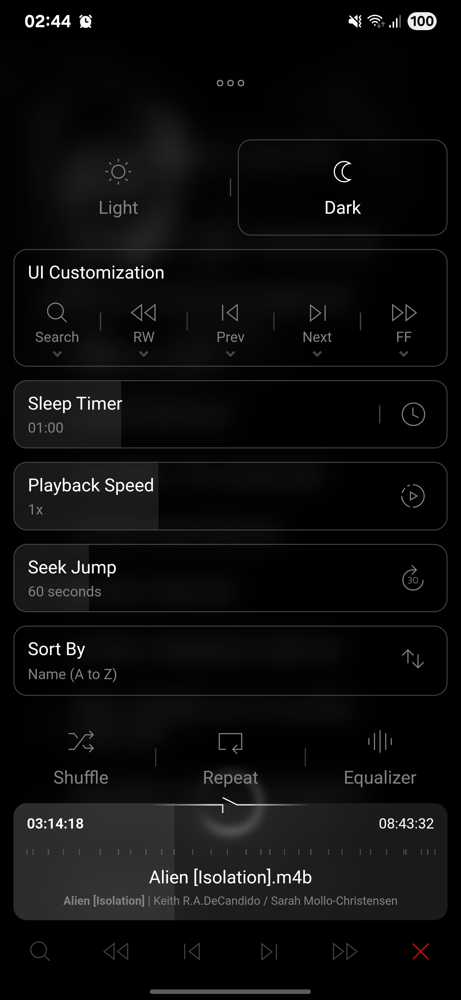
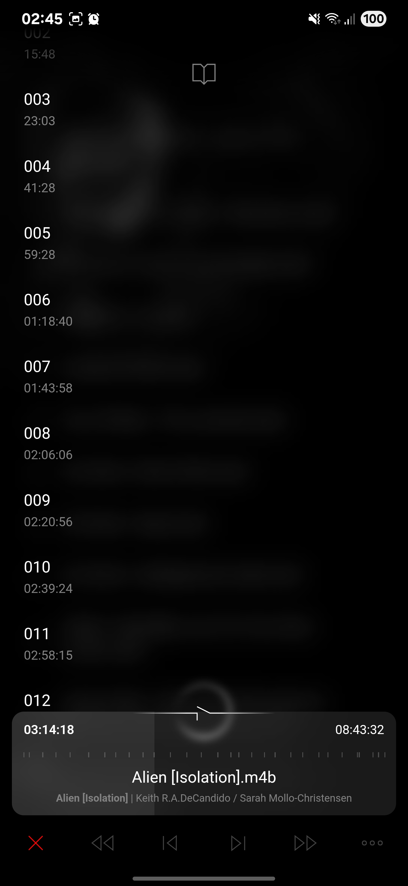
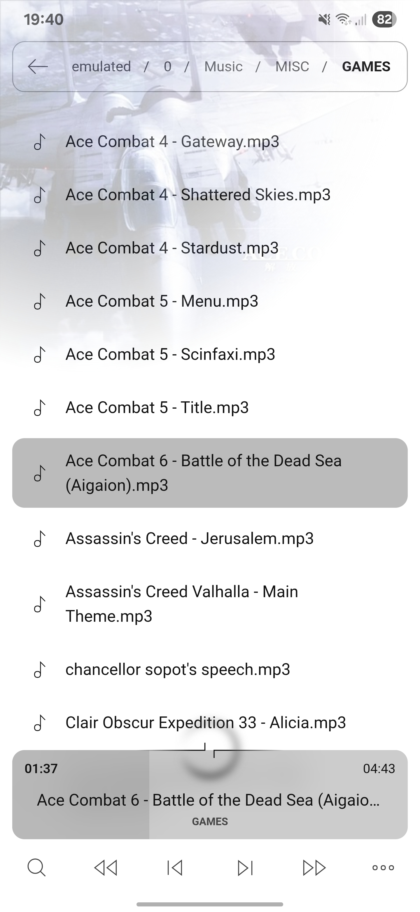

# Minimalist Music

A light weight, folder-based clean music player built with a combination of Kotlin for the Android native backend and Vanilla JavaScript/HTML/CSS for the frontend. It integrates native Android features with a web-based UI rendered in a WebView.

## Features
- Supports `mp3`, `wav`, `m4b`, `m4a`, `flac`, `midi`, `ogg`, `opus`, `aac` files
- Built-in folder explorer
- Dynamic queues (long-press a track item)
- Audiobook chapters
- Metadata lyrics unsynced (`UNSYNCEDLYRICS` tag) + synced (local lrc files)
- Maintains playback position, speed, shuffle, and repeat states, etc.
- Lock screen + Bluetooth controls
- Light + Dark themes
- Change playback speed
- Sleep timer
- Search
- Customizable UI

## Thanks
- @wseemann for the awesome `ffmpegmediametadataretriever` library. The only metadata library I found that could retrieve embedded chapters.
- [Angular Icons](https://angularicons.com/) for the awesome icons.

## Screenshots
|Now Playing|Now Playing|Select Mode|
|:-:|:-:|:-:|
||||

|Settings|Chapters|Light Theme|
|:-:|:-:|:-:|
||||

## Architecture Overview
The application follows a **Hybrid Architecture**, effectively splitting responsibilities between a web-based Frontend for the UI and a native Android Backend for core functionality.

### **1. Frontend (WebView)**
Located in `app/src/main/assets`, the UI is built using **Vanilla JavaScript, HTML, and CSS** without any heavy frameworks. It runs inside an Android `WebView`.
- **Foundation** (`app/src/main/assets/foundation`): Contains the core infrastructure for the frontend.
  - `event-bus.js`: The central communication hub that publishes/subscribes to events. It handles internal UI events and bridges communication with the Android backend.
  - `state.js`: Manages the frontend application state.
  - `html-element-base.js`: A base class for custom web components, standardizing how UI elements are built.

### **2. Backend (Native Android)**
Located in `app/src/main/java/com/minimalist/music`, the backend handles heavy lifting like file access, media playback, and system integrations.
- **Foundation** (`.../foundation`):
  - `EventBus.kt`: The native counterpart to the JS EventBus. It receives JSON events from the WebView via a `@JavascriptInterface` and dispatches native events to the UI by injecting JavaScript (`evaluateJavascript`).
  - `Moirai.kt`: A custom threading utility that provides `BG` (Background) and `MAIN` (UI) handlers, replacing Coroutines for detailed control over thread execution.
- **Player** (`.../player`):
  - `PlaybackManager.kt`: A **Foreground Service** responsible for `MediaPlayer` management, audio focus, and handling playback controls (Play, Pause, Seek). It listens to `EventBus` events to control playback.
  - `MediaNotificationManager.kt` & `MediaSessionManager.kt`: Handle system notifications and media session integration (lock screen controls, Bluetooth headsets).

### **3. Communication Bridge**
The app relies on a bidirectional **EventBus** system:
1. **JS to Native**: The WebView calls a global Android interface (e.g., `window.IPC.dispatch(json)`), which routes to `EventBus.kt`.
2. **Native to JS**: `EventBus.kt` constructs a JSON string and executes `window.EventBus.dispatch(event)` in the WebView.
This decoupled design allows the UI to be completely strictly separated from the player logic.
